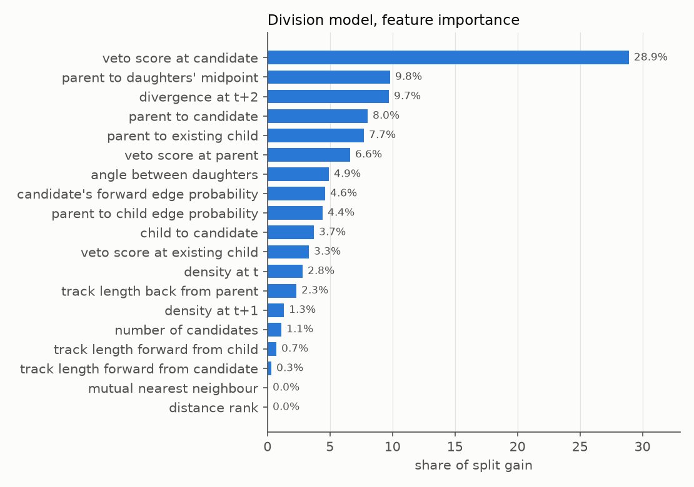

# Cell tracking with a LightGBM division classifier and a coordinate refinement head

## Context

- Business context: https://www.kaggle.com/competitions/biohub-cell-tracking-during-development/overview
- Data context: https://www.kaggle.com/competitions/biohub-cell-tracking-during-development/data

## TL;DR

A temporal 3D U-Net detector, a transformer edge scorer and an ILP linker, with two
additions on top. The first is a small network that moves each detected centre by up
to 2 µm, averaged 50/50 with a second head of the same architecture. The second is a
LightGBM model that decides cell divisions from 19 geometric and network features,
trained on division candidates logged from training videos. It replaced a
rule-based division step and was the largest single gain on the private
leaderboard, from 0.921 to 0.929.

The code and charts are also in a notebook: https://www.kaggle.com/code/vyask21/cell-tracking-division-model-and-coordinate-head

## Overview of the approach

### Pipeline

1. Detection: a temporal 3D U-Net run on volumes downsampled 4x in y and x, two
   seeds fused, peaks extracted by local maximum.
2. Edge scoring: a transformer scores candidate links between consecutive frames
   from U-Net features at both ends, run forward and backward in time and fused.
3. Linking: an ILP over the scored candidates, followed by gap closing, a motion
   relink and a gap filler that recovers weak detections between broken tracks.
4. Coordinate refinement: a per-detection shift predicted from U-Net features.
5. Divisions: a LightGBM classifier over division candidates.

Steps 1 to 3 are the public U-Net, transformer and ILP stack from this
competition's Code tab, with its settings unchanged. Steps 4 and 5 are mine.

### Validation

The public detector weights were trained on 180 of the 199 training videos, so the
remaining 19 are the only local videos that behave like the hidden test set. The
network that vetoes divisions was trained on every `44b6` video, so for anything
involving divisions only the `6bba` videos are out of sample. Both components below
were fitted on training videos and scored on those 19.

Single-setting changes to the base stack did not transfer from local scores to the
leaderboard. Lowering the division veto threshold from 0.20 to 0.10 read +0.0033
locally and lost 0.002 on the leaderboard, and opening two division gates read
+0.0041 and also lost 0.002. Settings on the base stack were left as published.

## Details of the submission

### 1. Coordinate refinement

Detections are local maxima on a grid with 1.625 µm spacing in every axis, so each
centre carries up to about 0.8 µm of quantisation error per axis before any model
error. The refinement head reads the U-Net decoder features at the detection and its
six neighbours and predicts a 3D shift.

- Input: 32 feature channels at the centre voxel, plus the difference between each
  of the six face neighbours and the centre, 224 values.
- Head: `Linear(224, 32)`, `SiLU`, `Linear(32, 3)`, output bounded to 2 µm by
  `2d / (1 + |d|)`.
- Targets: run the pipeline on training videos with a hook that saves the features
  at every detection, match detections to annotated cells within 4 µm, and regress
  the offset to the matched cell. 32,740 pairs from 59 videos.
- Training: 2,000 full-batch AdamW steps, learning rate 3e-3, weight decay 1e-3,
  features standardised.

```python
def make_head():
    head = torch.nn.Sequential(torch.nn.Linear(224, 32), torch.nn.SiLU(), torch.nn.Linear(32, 3))
    torch.nn.init.zeros_(head[-1].weight)
    torch.nn.init.zeros_(head[-1].bias)
    return head

def bounded(head, x):
    d = head(x)
    return 2.0 * d / (1.0 + torch.linalg.vector_norm(d, dim=-1, keepdim=True))
```

The training pairs carry an embryo-level bias. On held-out `6bba` videos the
annotated centre sits 0.97 µm higher in z than the detection on average, and every
one of the 14 videos falls between 0.68 and 1.35 µm. On `44b6` the offset is 0.10 µm.
A head fitted on 19 videos, most of them `6bba`, picked up the `6bba` offset and made
every `44b6` video worse. Training on 59 videos with more `44b6` among them fixed
that: on the held-out 19 it moved centres 24% closer to the annotation, and every
video improved.

The final shift is the average of this head and a second head of the same
architecture.

| coordinate head | public | private |
|---|---|---|
| none | 0.946 | 0.913 |
| second head alone | 0.953 | 0.917 |
| my head alone, 59 videos | 0.950 | 0.919 |
| 50/50 average of the two | 0.956 | 0.921 |

### 2. Division classifier

A division in the submission is a parent node with two outgoing edges. The base stack
added divisions with a cascade of fixed checks: two distance gates, a
mutual-nearest-neighbour test, a divergence test, a veto score from a second U-Net
and a symmetry test. On the held-out videos it found 2 of 19 annotated divisions.

I replaced the cascade with a classifier.

Candidates. For every track node with exactly one successor, every unlinked
detection in the next frame within 14 µm of the parent and 20 µm of the existing
child is a candidate daughter. This gate is looser than the cascade's, so the
classifier also sees the candidates the cascade rejected.

Features, 19 per candidate:

- distances: parent to existing child, parent to candidate, child to candidate, and
  parent to the midpoint of the two daughters
- divergence: how much further apart the two daughters' successors are at t+2 than
  the daughters are at t+1
- the veto network's score at the candidate, the existing child and the parent
- the edge probability from parent to existing child, and of the candidate's own
  forward link
- the cosine of the angle between the two daughter directions
- track length forward from each daughter and backward from the parent
- local density at t and t+1, the candidate's distance rank, the number of candidates
  and whether the candidate is the existing child's mutual nearest neighbour

Labels. A candidate is positive when the parent matches an annotated division and
both daughters match its two annotated children. Candidates are kept only when the
parent matches an annotated cell with an annotated successor, since those are the
only ones the metric scores. Across 119 training videos the pipeline logged 356,717
candidates, 8,083 of them scoreable, with 47 positives.

Model. LightGBM, trained on the 100 videos the detector had seen and evaluated on
the 19 it had not.

```python
params = dict(objective="binary", learning_rate=0.03, num_leaves=15, min_data_in_leaf=20,
              feature_fraction=0.8, bagging_fraction=0.8, bagging_freq=1, lambda_l2=1.0, seed=0)
model = lgb.train(params, lgb.Dataset(X_train, y_train), 300)
```

At inference the candidates are scored and accepted greedily from the highest score
down, each parent and each daughter at most once, until the score falls below the
threshold.

```python
order = np.argsort(-p)
used_parent, used_daughter, divisions = set(), set(), []
for i in order:
    if p[i] < threshold:
        break
    if parent[i] in used_parent or daughter[i] in used_daughter:
        continue
    used_parent.add(parent[i]); used_daughter.add(daughter[i])
    divisions.append((parent[i], daughter[i]))
```

On the 19 held-out videos the model ranked candidates with an AUC of 0.991 and an
average precision of 0.315, against a positive rate of 0.006.

| held-out videos, 19 annotated divisions | division Jaccard | true | false |
|---|---|---|---|
| rule-based cascade | 0.071 | 2 | 9 |
| LightGBM, threshold 0.01 | 0.167 | 6 | 17 |

The veto network's score at the candidate carries the most gain, followed by the
division geometry. The mutual-nearest-neighbour test, a hard gate in the cascade,
carries none.



### Threshold

False divisions are expensive. Each one adds a link the metric counts as a false
positive when it touches an annotated cell, on top of a false positive in the
division term. Retraining on 176 videos with 56 positives raised held-out average
precision from 0.315 to 0.640, yet it scored lower on the private leaderboard: 0.928
against 0.929 at threshold 0.01, and 0.926 against 0.928 at 0.02. The first model
shipped.

## Results

| submission | public | private |
|---|---|---|
| base stack, second coordinate head | 0.953 | 0.917 |
| + my coordinate head, 50/50 average | 0.956 | 0.921 |
| + division classifier, threshold 0.01 | 0.957 | 0.929 |
| + division classifier, threshold 0.02 | 0.957 | 0.928 |
| + division classifier retrained, threshold 0.01 | 0.956 | 0.928 |

## What did not work

- Single-setting changes to the base stack: division veto thresholds of 0.10 and
  0.25, two wider division gates, and the division gate values from another public
  variant. None improved on the unchanged stack, at 0.945 to 0.953 public.
- Scaling the coordinate shift: 0.5x scored 0.945 public, and 0.75x and 1.25x
  matched 1.0x at 0.953.
- A blend weight other than 0.5 between the two heads: 0.35 scored 0.952 public and
  0.65 matched 0.5 at 0.956.
- A five-seed ensemble of my head trained on 159 videos: 0.954 public against 0.956
  for the single head.
- A lower division threshold, 0.005: 0.947 public against 0.957 at 0.01.
- Choosing heads by distance to the annotation on the held-out videos. That measure
  ranked the heads in the opposite order to the leaderboard.

## Sources

- Organisers' baseline and metric: https://github.com/royerlab/kaggle-cell-tracking-competition
- The public U-Net, transformer and ILP notebooks and model datasets in this
  competition's Code tab, which steps 1 to 3 are built on
- LightGBM: https://github.com/microsoft/LightGBM

Code for both components, the capture and labelling kernels, and the full
experiment log: https://github.com/vyask21/cell-tracking
